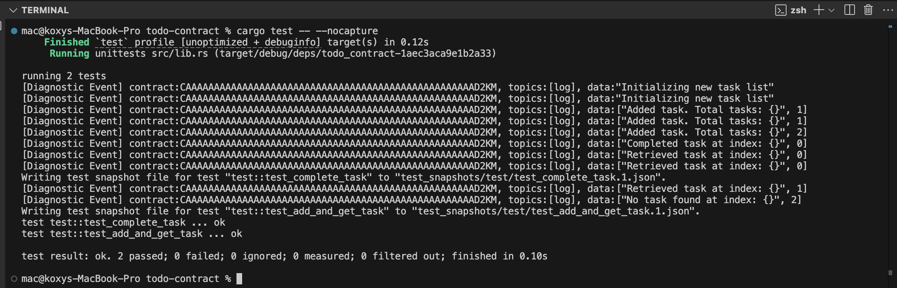
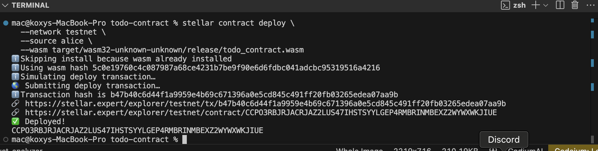

# Soroban Todo Contract

- This is a simple Todo  smart contract built on the Soroban(Stellar blockchain). It allows users to create, complete, and retrieve tasks in a decentralized manner.


## Features

- Add new tasks with a title and description
- Mark tasks as completed
- Retrieve all tasks
- Get a specific task by index
- Automatically extends storage lifetime


## Storage
- The contract uses Soroban's storage functionality to persist tasks. The storage lifetime is extended by 100 ledgers each time a task is added or completed.

# Testing
`cargo test`

# Build
`stellar contract build`

# Deploy
`stellar contract deploy \
  --wasm target/wasm32-unknown-unknown/release/todo_contract.wasm \
  --source alice \
  --network testnet`


```text
.
├── contracts
│   └── todo_contract
│       ├── src
│       │   ├── lib.rs
│       │   └── test.rs
│       └── Cargo.toml
├── Cargo.toml
└── README.md
```

[Deployed link](https://stellar.expert/explorer/testnet/tx/b47b40c6d44f1a9959e4b69c671396a0e5cd845c491ff20fb03265edea07aa9b)


